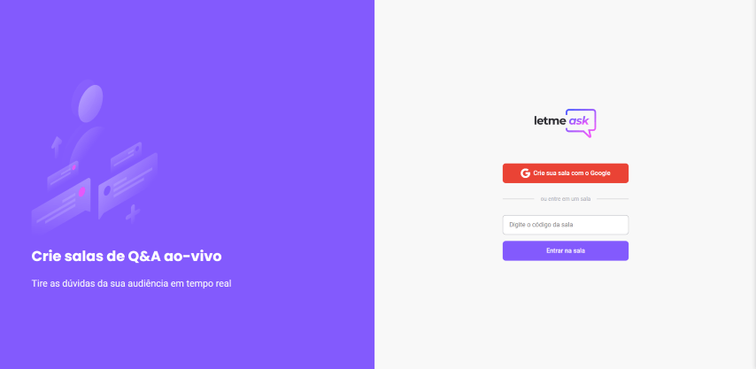
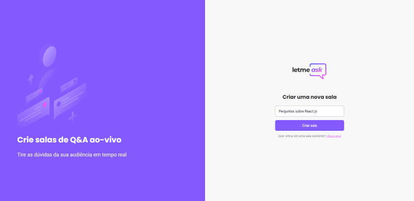
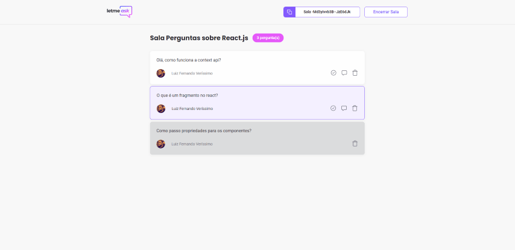

<p align="center">
  
</p>
<h1 align="center">Let me Ask - NLW Together 👋</h1>
<p>
  
  <a href="#" target="_blank">
    
  </a>
</p>

> 💬❓ Question organizer for live events, created during NLW Together with React.js and Firebase.

### ✨ [Demo](https://letmeask-94570.web.app/)

## Screenshots

   

## Install

```sh
yarn
```

## Usage

```sh
yarn start
```

## Author

👤 **LF Verissimo**

* Website: https://lfverissimo.com
* Github: [@luizfverissimo](https://github.com/luizfverissimo)
* LinkedIn: [@lfverissimo](https://linkedin.com/in/lfverissimo)

## Show your support

Give a ⭐️ if this project helped you!

***
_This README was generated with ❤️ by [readme-md-generator](https://github.com/kefranabg/readme-md-generator)_